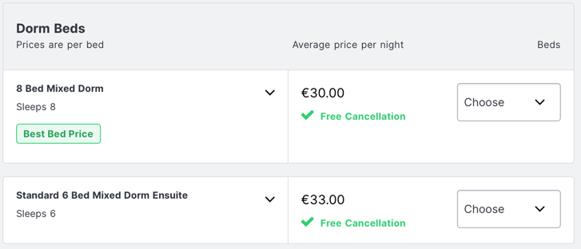
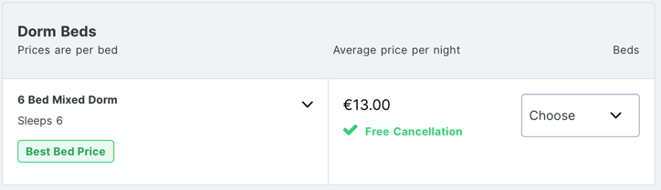
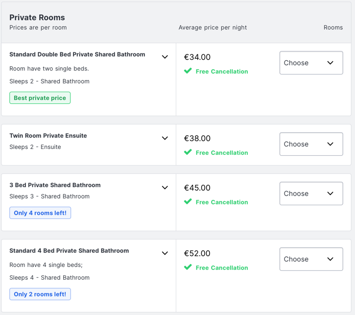

# Marlon JGA

Moin allerseits :-)

Aus euren Aufenthaltsorten, Luxus-/Preisvorstellungen und sonstigen Sonderwünschen einen Kompromiss zu basteln war nicht ganz einfach.
Daher seht ihr unten meinen Reise-Vorschlag als Kompromiss für alle Teilnehmer.

_Gruppen:_

Ich habe alle Teilnehmer je nach Wohnort in Gruppen aufgeteilt. Jede Gruppe hat einen Leiter. Zusätzlich zu unserer bisherigen WhatsApp-Gruppe erstelle ich für die Gruppenplanung je eine weitere WhatsApp-Gruppe. **Reagiert dort schnell auf Nachrichten**, dass die Planung klappt.

Falls jemand die Gruppe wechseln möchte, (bspw Marc und Konrad von Gruppe Pforzheim nach Gruppe Nürnberg), meldet euch bitte so schnell wie möglich.

_Individuelle Planung:_

Grundsätzlich kann jeder auf eigene Faust planen und nur teilweise oder gar nicht an meinem Vorschlag teilnehmen. Beispielsweise:
- spielt Chris mit dem Gedanken am 23.05 nicht zurückzufliegen, sondern alleine weiterzureisen
- kann Finn nicht beim Hamburger Teil der Gruppe SH mitmachen, sondern würde samstags ggfs aus Billund fliegen
- plant Alex Emde aus beruflichen Gründen alles selbst

Es steht euch also frei selbst zu planen, aber macht das bitte auf eigene Faust und ohne die Leiter in Verantwortung zu ziehen. Sonst wird das für die Leiter und mich zu kompliziert. Einfach beim Gruppenleiter abmelden und viel Spaß :-)

_Treffpunkt Hostel:_

Meine Bitte ist, dass wir (gerade bei individueller Planung) versuchen im gleichen Hostel in Vilnius (und Hamburg) unterzukommen. Manche Teilnehehmer wollen eine private Unterkunft, überlegt euch bitte, ob ein privates Zimmer im Hostel für euch okay wäre. Dann wären wir vor Ort alle zusammen und können Airport-Transfers, gemeinsame Abende etc leichter planen.

Das Hostel in Vilnius hat viele unterschiedliche Zimmergrößen und für jeden Geldbeutel ist etwas dabei. Eine Luxus-Suite gibt es zwar nicht, aber es ist ja auch ein JGA.

_Marlon:_

Marlon weiß nur, wann der JGA stattfindet. Er hat bereits Urlaub genommen. Er weiß aber nicht _was_ stattfindet. Und das soll bitte auch so lange wie möglich bleiben. Lasst uns versuchen ihn zu überraschen. Passt bitte auch auf, mit wem ihr diese Webseite teilt. Sie ist öffentlich zugänglich.

## Flüge

Alle Flüge werden von Ryanair angeboten. Daher sind es günstige Flüge. Ein one-way Ticket liegt gerade zwischen 20€ und 60€.

Hinflug ist immer am Samstag, 20.05.2023.
Rückflug immer am Dientag, 23.05.2023.

Nur Handgepäck mit einer Zahnbürste und ein paar Wechselklamotten müsste für 3 Tage eigentlich reichen. Aber bitte aufpassen: Keine Flüssigkeiten im Handgepäck. \
Da wir alle EU-Bürger sind, reicht ein Nationalausweis aus. Kein Reisepass nötig.

**Last uns bitte zeitnah buchen, solange es noch günstige Varianten gibt. Die Preise sind schon gestiegen.**

| Flughafen   | Hinflug       | Rückflug                                                                                                                                                                                                                                                                                                                                                                     |
|-------------|---------------|------------------------------------------------------------------------------------------------------------------------------------------------------------------------------------------------------------------------------------------------------------------------------------------------------------------------------------------------------------------------------|
| Bremen      | [16:40](https://www.ryanair.com/de/de/trip/flights/select?adults=1&teens=0&children=0&infants=0&dateOut=2023-05-20&dateIn=&isConnectedFlight=false&isReturn=false&discount=0&promoCode=&originIata=BRE&destinationIata=VNO&tpAdults=1&tpTeens=0&tpChildren=0&tpInfants=0&tpStartDate=2023-05-20&tpEndDate=&tpDiscount=0&tpPromoCode=&tpOriginIata=BRE&tpDestinationIata=VNO) | [18:15](https://www.ryanair.com/de/de/trip/flights/select?adults=1&teens=0&children=0&infants=0&dateOut=2023-05-23&dateIn=&isConnectedFlight=false&discount=0&isReturn=false&promoCode=&originIata=VNO&destinationIata=BRE&tpAdults=1&tpTeens=0&tpChildren=0&tpInfants=0&tpStartDate=2023-05-23&tpEndDate=&tpDiscount=0&tpPromoCode=&tpOriginIata=VNO&tpDestinationIata=BRE) | 
| Nürnberg    | [19:25](https://www.ryanair.com/de/de/trip/flights/select?adults=1&teens=0&children=0&infants=0&dateOut=2023-05-20&dateIn=&isConnectedFlight=false&discount=0&isReturn=false&promoCode=&originIata=NUE&destinationIata=VNO&tpAdults=1&tpTeens=0&tpChildren=0&tpInfants=0&tpStartDate=2023-05-20&tpEndDate=&tpDiscount=0&tpPromoCode=&tpOriginIata=NUE&tpDestinationIata=VNO) | [09:10](https://www.ryanair.com/de/de/trip/flights/select?adults=1&teens=0&children=0&infants=0&dateOut=2023-05-23&dateIn=&isConnectedFlight=false&discount=0&isReturn=false&promoCode=&originIata=VNO&destinationIata=NUE&tpAdults=1&tpTeens=0&tpChildren=0&tpInfants=0&tpStartDate=2023-05-23&tpEndDate=&tpDiscount=0&tpPromoCode=&tpOriginIata=VNO&tpDestinationIata=NUE) | 
| Berlin      | [11:50](https://www.ryanair.com/de/de/trip/flights/select?adults=1&teens=0&children=0&infants=0&dateOut=2023-05-20&dateIn=&isConnectedFlight=false&discount=0&isReturn=false&promoCode=&originIata=BER&destinationIata=VNO&tpAdults=1&tpTeens=0&tpChildren=0&tpInfants=0&tpStartDate=2023-05-20&tpEndDate=&tpDiscount=0&tpPromoCode=&tpOriginIata=BER&tpDestinationIata=VNO) | [05:50](https://www.ryanair.com/de/de/trip/flights/select?adults=1&teens=0&children=0&infants=0&dateOut=2023-05-23&dateIn=&isConnectedFlight=false&discount=0&isReturn=false&promoCode=&originIata=VNO&destinationIata=BER&tpAdults=1&tpTeens=0&tpChildren=0&tpInfants=0&tpStartDate=2023-05-23&tpEndDate=&tpDiscount=0&tpPromoCode=&tpOriginIata=VNO&tpDestinationIata=BER) | 
| Billund     | [06:05](https://www.ryanair.com/de/de/trip/flights/select?adults=1&teens=0&children=0&infants=0&dateOut=2023-05-20&dateIn=&isConnectedFlight=false&discount=0&isReturn=false&promoCode=&originIata=BLL&destinationIata=VNO&tpAdults=1&tpTeens=0&tpChildren=0&tpInfants=0&tpStartDate=2023-05-20&tpEndDate=&tpDiscount=0&tpPromoCode=&tpOriginIata=BLL&tpDestinationIata=VNO) | [09:05](https://www.ryanair.com/de/de/trip/flights/select?adults=1&teens=0&children=0&infants=0&dateOut=2023-05-23&dateIn=&isConnectedFlight=false&discount=0&isReturn=false&promoCode=&originIata=VNO&destinationIata=BLL&tpAdults=1&tpTeens=0&tpChildren=0&tpInfants=0&tpStartDate=2023-05-23&tpEndDate=&tpDiscount=0&tpPromoCode=&tpOriginIata=VNO&tpDestinationIata=BLL) | 

## Unterkunft

### Hamburg

[JuHe Hamburg](https://www.hostelworld.com/pwa/hosteldetails.php/Jugendherberge-Hamburg-Auf-dem-Stintfang/Hamburg/41365?from=2023-05-18&to=2023-05-20&guests=2)

### Vilnius

[Fortuna-Hostel](https://www.hostelworld.com/pwa/hosteldetails.php/Fortuna-Hostel/Vilnius/42103?from=2023-05-20&to=2023-05-23&guests=2)

- Marlon kommt in ein 2 Bett-Zimmer und jemand kann dort mit dazu (Atze?).

- Olga und Schneggi könnten zu zweit in ein privates Zimmer.
- Sparfüchse können im 6 Bed Dorm unterkommen. Dieses Zimmer habe ich bereits komplett gebucht, dass wir es für uns alleine haben. Falls ihr ein Bett darin wollt, meldet euch bei mir.
- Gruppe Augsburg könnte in ein 3 Bed Zimmer, falls Alex Emde im Hostel schläft.
- Mir ist egal wo und wie ich schlafe. Falls in einem Zimmer eine Person fehlt, meldet euch :-)
- Gruppe SH könnte in ein 2 Bett Zimmer. Falls Finn ein eigenes Zimmer haben möchte, kann Marco sich bei mir melden. 

## Gruppen

### Gruppe Pforzheim

- Chris (Leiter)
- Alex Mezger
- Marc
- Konrad

Alex fährt eventuell mit dem Auto nach Hamburg und von dort aus direkt wieder heim. @Chris: Sprich dich bitte mit Alex ab ob er euch hochfährt, ansonsten bitte den ICE-Trip planen.

_Timeline:_
- 18.05: Hinfahrt in Alex' Auto, Check-in Hamburg
- 20.05: Weiter nach Bremen, Hinflug, Check-in Vilnius. Alex fährt von Hamburg direkt heim
- 23.05: Rückflug nach Nürnberg, Zug heim

### Gruppe Augsburg

- Bogi (Leiter)
- Lumpi
- Pete
- Alex Emde (individuell)

_Timeline:_
- 18.05: Hinfahrt mit ICE, Check-in Hamburg
- 20.05: Weiter nach Bremen, Hinflug, Check-in Vilnius
- 23.05: Rückflug nach Nürnberg, Zug heim

### Gruppe Nürnberg

- Schneggi (Leiter)
- Olga
- Wolle

_Timeline:_
- 20.05: Hinfahrt Flughagen mit ICE, Hinflug, Check-in Vilnius
- 23.05: Rückflug nach Nürnberg, Zug heim

### Gruppe Schleswig-Holstein (SH)

- Marco (Leiter)
- Marlon 
- Finn (ggfs. individuell)

- 18.05: Hinfahrt mit ICE, Check-in Hamburg
- 20.05: Weiter nach Bremen, Hinflug, Check-in Vilnius
- 23.05: Rückflug nach Bremen, Zug heim

@Marco: Marlon soll den Plan nicht kennen. Du musst ihn einfach nur nach Hamburg bringen.

Alternative:

- 20.05: Früh morgens nach Billund, Hinflug, Check-in Vilnius
- 23.05: Rückflug nach Billund, Zug heim

Billund ist mit ca. 20€ pro Flug günstig, aber den Hinflug zu erreichen kann knifflig werden. Habe keine Taxis oder Züge gefunden mit denen man aus Hamburg/Flensburg locker hinkommt. Bitte selbst drum kümmern, eventuell kann Mama euch hinfahren.

### Gruppe Berlin

- Atze (Leiter)

_Timeline:_
 
- 18.05: Zug nach Hamburg, Check-in Hamburg
- 20.05: Weiter nach Bremen, Hinflug, Check-in Vilnius
- 23.05: Rückflug nach Berlin

Alternative:

- 20.05: Abflug aus Berlin, Check-in Vilnius
- 23.05: Rückflug nach Berlin

